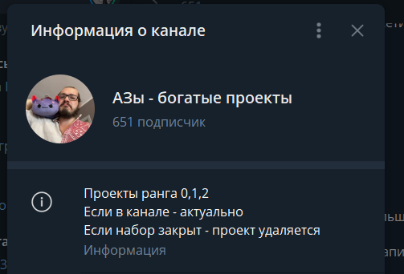
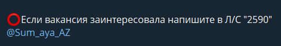

# Чек-лист: что делать новичку до взятия первого проекта?

## 1. **пройти обязательное обучение** – ты прошел этот этап!

## 2. И**зучить регламенты**

среди которых (для удобства – копируй себе этот док и отмечай галочками, что уже пройдено):

### [Житие специалиста](https://docs.google.com/document/d/1xIjl2ciRkVxrUwg0IRJi5jxZXE31RMpDfgG_eqt-Rwg/edit?usp=sharing)


[zhitie.md](start/zhitie.md)


_**Темы, которые ты должен освоить:**_

* [ ] Обязанности ассистента
* [ ] Библиотека
* [ ] Первые шаги после стажировки (обучения)
* [ ] Как правильно выбрать себе проект?
* [ ] Что делать, если вам не понравился проект после начала работы?
* [ ] Причины, по которым можно отказаться от проекта
* [ ] Обновление дашборда
* [ ] Как получить доступ к БРИФам и рабочим папкам?
* [ ] Как происходит увольнение?

### [Регламент по работе с клиентом](https://docs.google.com/document/d/16bMOsx2ajh8PuYD8p2jP03DMYJObBrIYsvQO72OaB1k/edit?usp=sharing)


[client-outreach.md](projects/client-outreach.md)


_**Темы, которые ты должен освоить:**_

* [ ] Правила общения
* [ ] Установочный созвон
* [ ] Рабочая деятельность
* [ ] Отчётность
* [ ] Регламентация проекта

### [Регламент по ведению отчетности](https://docs.google.com/document/d/1LcLGeVPrrD675z97xMVU4F4xBRSjsf9IxQiDuaMR9AY/edit#heading=h.r3qvq7mcpj2q)


[reporting.md](projects/reporting.md)


_**Темы, которые ты должен освоить:**_

* [ ] Типы отчетности
* [ ] Каким должен быть хороший отчет?
* [ ] Как ведется отчетность?
* [ ] Как заполнять БРИФ?
* [ ] Алгоритм ведения отчетности

### [Регламент по выплатам](https://docs.google.com/document/d/1fWfZH27Xv0j4dYuXXnlu9vP_MtJGNSUSUnXDZL0xV10/edit#heading=h.l112lwq7atby)


[payout.md](money/payout.md)


_**Темы, которые ты должен освоить:**_

* [ ] Что, когда и куда вносить
* [ ] Как узнать о размере выплаты?

### [Ранговая система](https://docs.google.com/document/d/1tRnBhonK6-UjnbXpSTv_SoQnrqXlWjP246R6YV8FHYA/edit#heading=h.plux002ttqs4)


[rank.md](money/rank.md)


_**Темы, которые ты должен освоить:**_

* Как работает ранговая система?
* Как набирать баллы?
* Аттестация на 2 ранг

## **3. Выбираем проект**

1. изучить вакантные проекты, их описание
2. связаться с закрепленным проджектом и сообщить, что хочешь взять определенный проект (пишешь имя клиента и номер проекта)
3. написать проджекту приветственное сообщение (по регламенту)
4. вступить в чат отдела
5. вступить в чат с клиентом
6. написать клиенту приветственное сообщение
7. принять задачи клиента в работу

Если тренер тебе долго не отвечает – маякни еще раз, чтобы сообщение стало выше среди прочих. В крайнем случае можешь написать на личный аккаунт Старшему тренеру – @mldo\_az

## 4. И**зучить вакантные проекты**

Все актуальные проекты наши проджеты публикуют в канале, к которому у тебя уже есть доступ.

Обращай внимание на все условия, требования и пожелания, которые есть в описании интересующих тебя проектов. Если возникают какие-то вопросы в рамках определенного проекта – запроси у проджекта запись созвона с клиентом. Возможно, там уже есть ответ. Но если после всего изучения проекта у тебя остались какие-то невыясненные моменты - пиши проджекту, чтобы их прояснить.

Твоя задача на этапе подбора проекта (или проектов) – максимально изучить проект, прежде чем взяться за работу на нем. Иначе просто не получится полноценно погрузиться в сущность задач; как следствие – быстро пропадет интерес/мотивация занятости на проекте, а оно ни тебе, ни нам не нужно. Будь внимателен!

## **5. Написать проджекту, что хочешь взять определенный проект**

Как только ты выяснил всё необходимое для себя о проекте и понял, что нашел идеальный вариант – пиши проджекту, который закреплен за определенным проектом (пример – см. скрин ниже), что тебе хочется взять в работу клиента.

Потом состоится небольшое общение с проджектом, в рамках которого ты задашь проджекту все интересующие вопросы (если есть), что сделает и проджект, в свою очередь, чтобы понять, подходишь ли ты для этого проекта.

## 6. Н**аписать проджекту приветственное сообщение**&#x20;

(как в регламенте), отредактировать его при необходимости, по комментарию проджекта

Это нужно сделать, **если ты берешь первый/второй проект в работу,** чтобы проджект просто проконтролировал, что у тебя всё хорошо и правильно расписано. Далее можно будет уже составленный текст копировать и отправлять, однако следи за тем, какие пожелания и требования есть у клиента: незачем оставлять в перечне навыков что-то, что клиенту не нужно. В первую очередь прописывай то, что актуально для клиента. И если еще есть что о себе рассказать - пиши что-то смежное с тем, что ему надо.

## 7. З**айти в чат с клиентом и написать клиенту привественное сообщение**

После взятия проекта проджект присылает тебе ссылку на чат с клиентом, а также добавляет в чат своего отдела, где будут проходить планерки и куда ты в том числе будешь писать отчетность.

## 8. **Ты в проекте!**

## [Чек-лист на знание регламентов](https://docs.google.com/spreadsheets/d/1CWNv8Jnqnu0BRrRRGTnIriXywQbIQhOwGGSEWBU5vzs/edit#gid=431025024)



